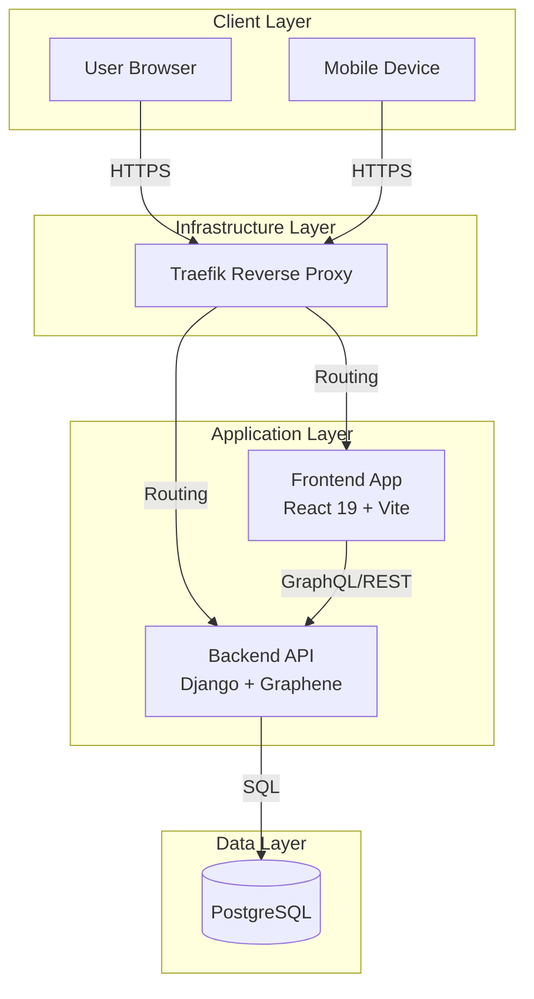
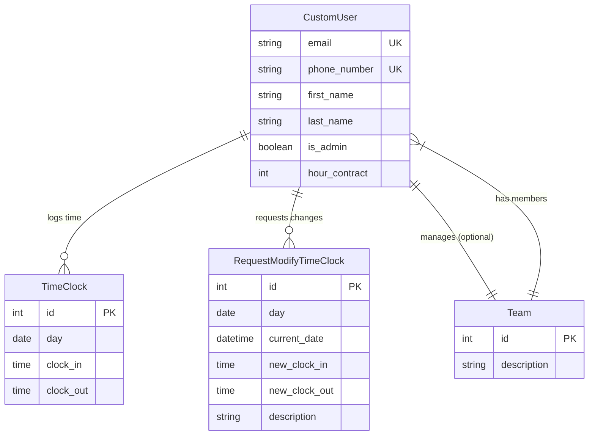

# Architecture & Design

**Time Manager** follows a modern, decoupled architecture separating the frontend user interface from the backend API services.

## :material-server-network: System Overview

The system is composed of containerized services orchestrated by **Docker Swarm**.

## :material-database: Database Schema

The core data model uses a customized User model and relational structures for Teams and Time Tracking.

## :material-tools: Technology Stack

### Backend

| Component | Technology | Description |
|:----------|:-----------|:------------|
| **Language** | Python 3.12 | Core programming language |
| **Framework** | Django 5.2 | Web framework |
| **API** | GraphQL & REST | Graphene-Django for GraphQL |
| **Database** | PostgreSQL | Relational database |
| **Auth** | JWT | JSON Web Tokens |
| **Package Manager** | uv | Fast Python package installer |

### Frontend

| Component | Technology | Description |
|:----------|:-----------|:------------|
| **Framework** | React 19 | UI library |
| **Build Tool** | Vite (Rolldown) | Next-gen bundler |
| **Styling** | TailwindCSS 4 | Utility-first CSS |
| **Components** | Radix UI | Headless component library |
| **State/Data** | Apollo Client | GraphQL client |
| **Linting/Formatter** | Biome | Fast code quality tool |

### DevOps

| Component | Technology | Description |
|:----------|:-----------|:------------|
| **Containerization** | Docker | Application containers |
| **Orchestration** | Docker Swarm | Container orchestration |
| **Reverse Proxy** | Traefik | HTTP reverse proxy |
| **CI/CD** | GitHub Actions | Automated workflows |
| **Quality** | SonarQube | Code quality analysis |
