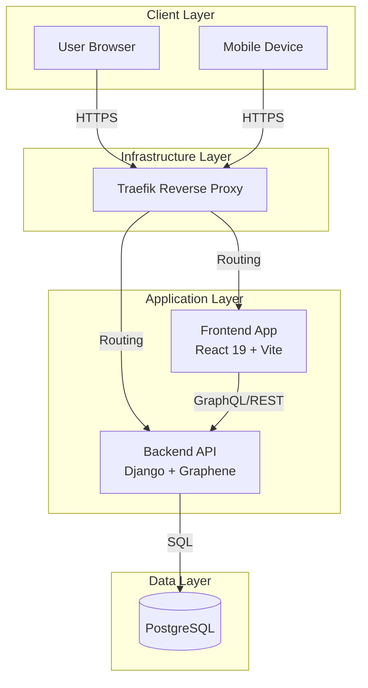
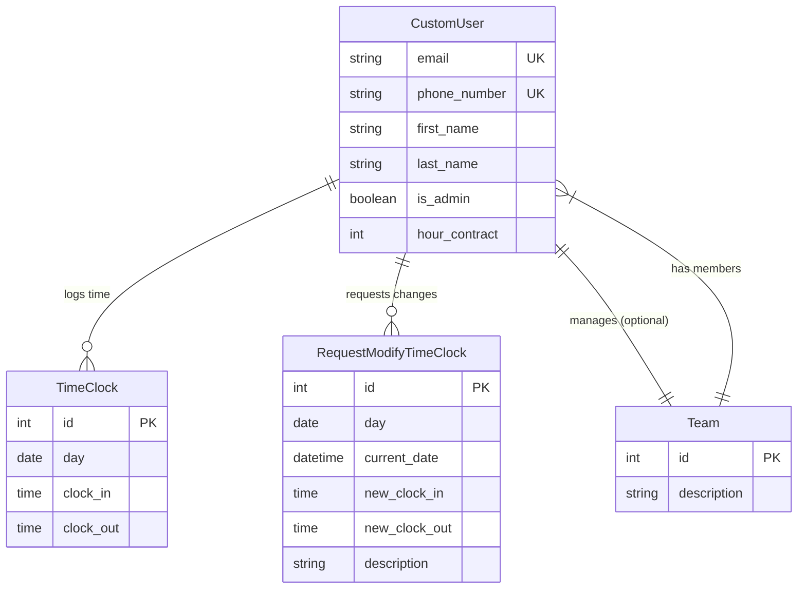

# Architecture & Design

**Time Manager** follows a modern, decoupled architecture separating the frontend user interface from the backend API services.

## :material-server-network: System Overview

The system is composed of containerized services orchestrated by **Docker Swarm**.

## :material-database: Database Schema

The core data model uses a customized User model and relational structures for Teams and Time Tracking.

## :material-tools: Technology Stack

### Backend

-   **Language**: Python 3.12
-   **Framework**: Django 5.2
-   **API**: GraphQL (Graphene-Django) & REST
-   **Database**: PostgreSQL
-   **Auth**: JWT (JSON Web Tokens)
-   **Package Manager**: `uv`

### Frontend

-   **Framework**: React 19
-   **Build Tool**: Vite (Rolldown)
-   **Styling**: TailwindCSS 4
-   **Components**: Radix UI
-   **State/Data**: Apollo Client (GraphQL)
-   **Linting/Formatter**: Biome

### DevOps

-   **Containerization**: Docker
-   **Orchestration**: Docker Swarm
-   **Reverse Proxy**: Traefik
-   **CI/CD**: GitHub Actions
-   **Quality**: SonarQube
