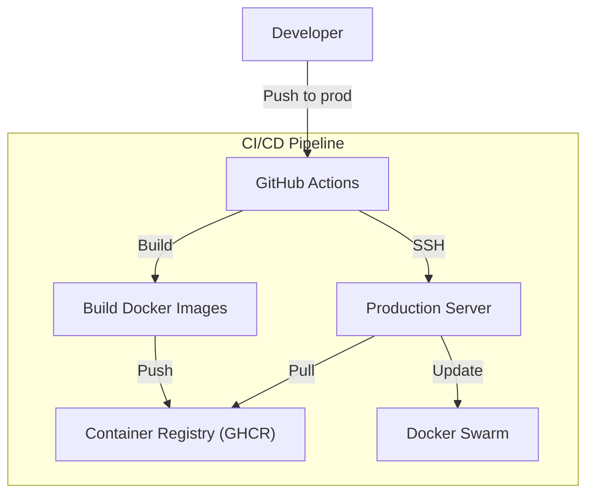

# Deployment & Infrastructure

**Time Manager** is deployed on a production environment managed via **Docker Swarm** and **Traefik**.

## :material-web: Live Environment

Access the live services at the following URLs:

| Service | URL | Description |
| :--- | :--- | :--- |
| **Web Application** | [https://ytlabs.space](https://ytlabs.space) | The main user interface. |
| **API Endpoint** | [https://api.ytlabs.space](https://api.ytlabs.space) | The backend GraphQL/REST API. |
| **Documentation** | [https://docs.ytlabs.space](https://docs.ytlabs.space) | This documentation site. |
| **SonarQube** | [https://sonarqube.ytlabs.space](https://sonarqube.ytlabs.space) | Code quality and security analysis. |

## :material-server-network: Infrastructure Overview

The production infrastructure consists of a **Docker Swarm** cluster.

### Key Components

-   **Orchestrator**: Docker Swarm handles service scheduling and scaling.
-   **Reverse Proxy**: **Traefik** manages ingress traffic, SSL termination (Let's Encrypt), and load balancing.
-   **CI/CD**: GitHub Actions automates the build and deployment pipeline.

### Deployment Workflow

The deployment process is fully automated using GitHub Actions.



### Stack Configuration (`stack.yml`)

The `stack.yml` file defines the production services and their deployment rules.

| Service | Description | Replicas | Key Config |
| :--- | :--- | :--- | :--- |
| **Traefik** | Reverse Proxy & Load Balancer | 1 (Manager only) | Handles `letsencrypt` certs, routing, and HTTP->HTTPS redirection. |
| **Backend** | Django API | 1 | Healthchecks, rolling updates, and Traefik labels for `api.ytlabs.space`. |
| **Frontend** | React App | 2 | Load balanced by Traefik for `ytlabs.space`. |
| **DB** | PostgreSQL 16 | 1 (Pinned) | Persistent volume `db_data`. |
| **SonarQube** | Code Quality | 1 | Internal tool available at `sonarqube.ytlabs.space`. |

#### Deployment Strategy

-   **Update Config**: Services update with `order: start-first` to ensure zero-downtime (new container starts before old one stops).
-   **Rollback**: Automatically rolls back on failure (`failure_action: rollback`).
-   **Networking**: All services communicate on the overlay network `time-manager-net`.

## :material-sync: CI/CD Pipelines

The project uses three main workflows to automate testing, deployment, and mirroring.

### 1. Continuous Integration (CI)
**File:** `.github/workflows/ci.yml`

Triggered on push/PR to `main`. ensures code quality before merging.

-   **Frontend Job**:
    -   Setup Bun environment.
    -   Linting (`biome check`).
    -   Formatting (`biome format`).
    -   Unit Tests (`bun test`).
-   **Backend Job**:
    -   Setup Python & uv.
    -   Linting (`ruff check`).
    -   Django Tests (`python manage.py test`) against a service Postgres DB.
-   **SonarQube Job**:
    -   Performs static code analysis and checks quality gates.

### 2. Build & Deploy (CD)
**File:** `.github/workflows/deploy.yml`

Triggered on push to `prod`. Handles the delivery to the live environment.

1.  **Build Phase**:
    -   Builds Docker images for Backend and Frontend.
    -   Tags images with commit SHA and `latest`.
    -   Pushes images to **GitHub Container Registry (GHCR)**.
2.  **Deploy Phase**:
    -   Connects to the production server via SSH.
    -   Generates `.env` file from GitHub Secrets.
    -   Updates the stack using `docker stack deploy`.
    -   Performs cleanup (prunes old images to save space).

### 3. Repository Mirroring
**File:** `.github/workflows/mirror.yml`

Triggered when a PR is merged to `main` or `dev`.
-   Automatically pushes the code changes to an external mirror repository (e.g., for academic or backup purposes).

## :material-rocket-launch: Deployment Commands

The deployment is largely automated, but manual actions can be performed on the server if necessary.

### Deploying the Stack

The application is defined in `stack.yml` for production.

```bash
docker stack deploy -c stack.yml time-manager
```

### Managing Services

Check the status of the stack services:

```bash
docker stack services time-manager
```

View logs for a specific service:

```bash
docker service logs -f time-manager_backend
```

## :material-security: Security & Monitoring

-   **SSL/TLS**: All public endpoints are secured with HTTPS via Traefik.
-   **Secrets Management**: Sensitive data (DB passwords, keys) are managed via Docker Secrets or environment variables injected at runtime.
-   **Code Quality**: Continuous inspection via SonarQube ensures maintainability and reliability.
